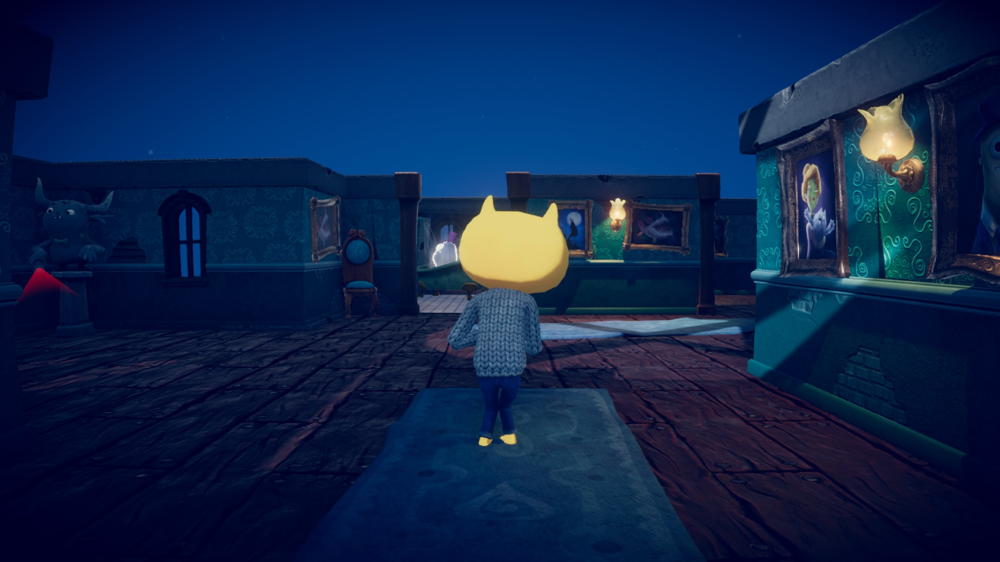
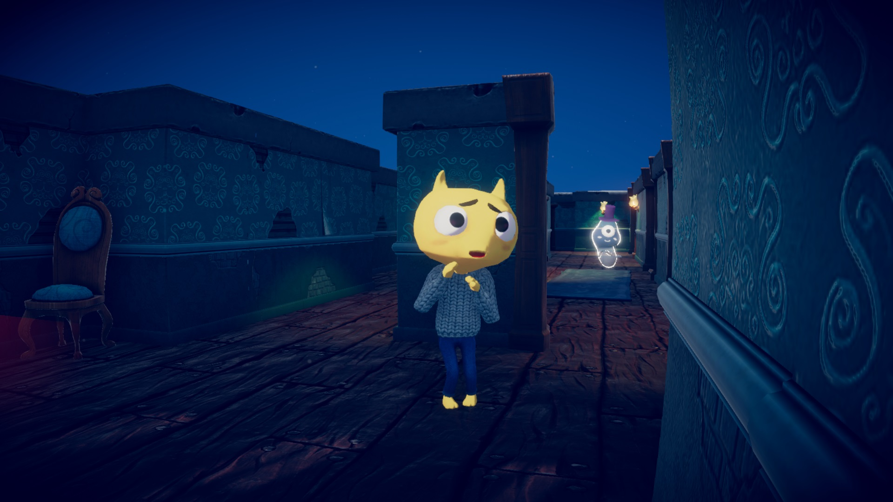
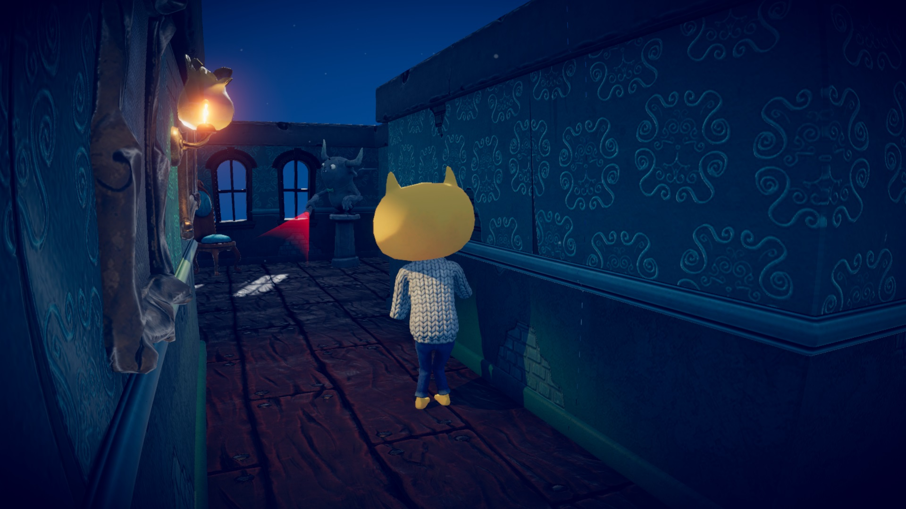
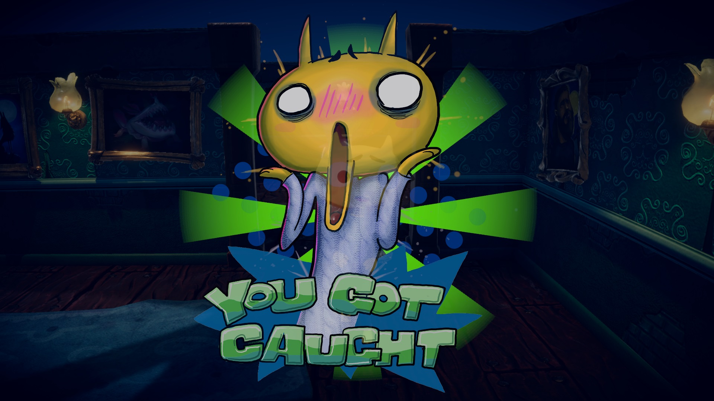

# EscapeGame
The game is a 3rd person stealth game made using assets from the Unity Asset store and developed with the help of a guide found on the Learn Unity website. All aspects of the scripting was coded by me. The guide that was followed to build the game can be found here: https://learn.unity.com/project/john-lemon-s-haunted-jaunt-3d-beginner

The game features a character, temporarily named John Lemon for his unique head, who must escape the haunted house by escaping the gazes of gargoyles and ghosts. Gargoyles are stationary enemies while ghosts roam through designated paths. The game features the use of a navigation mesh and waypoints to determine the pathing of the ghosts. Hitboxes are used to determine if the player has been seen by an enemy, with raycasting implemented to ensure that the player isn't being seen through walls.

The camera has been changed to being over-the-shoulder and controlled by a mouse, which gives a more immersive experience and increases the difficulty since it is harder to see where the ghosts are.

# Further improvements
- The goal is to add an escape room element to the game, rather than just navigating through the maze
- Add inventory system
- Add interactive objects (keys, opening a book, pushing buttons)
- Modify map to add complexity and variation
- Add additional enemies, generate variation in their behaviour to add difficulty
- Add title screen
- Add user settings (sound volume, mouse sensitivity, etc)
- Fix any miscellaneous bugs
- and much more!

# Playing the game
The game is best played as an application on a computer. Copy the "Build" folder to your local directory and run the .exe file inside.

If necessary, a build has been made with WebGL so that it can be played using the link below for convinience.

https://play.unity.com/mg/other/webgl-build-850

# Screenshots
Below are some screenshots of the game.

Start

Gameplay
 

More gameplay

Caught

